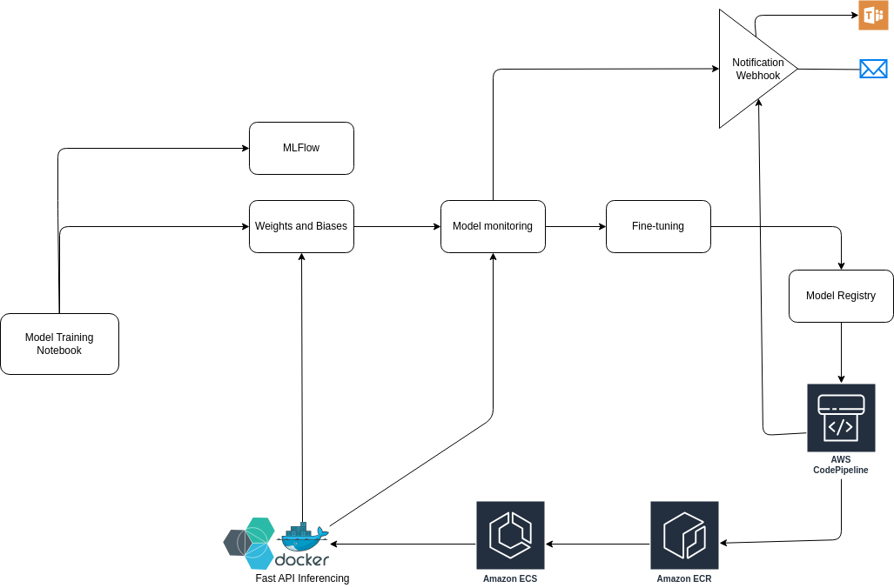

# MLOps Pipeline for Flair on AWS and Weights & Biases

API Docs: [http://0.0.0.0:8080/docs](http://0.0.0.0:8080/docs)




The above is an overview system design for online ingerencing for a simple text-classification system. Although this system doesn't handle the text preprocessing and feature generation pipeline itself.

Here, the system is divided into 3 parts

1. **Model Training**

   1. Local Jupyter Notebook
   2. AWS Sagemaker Training Job
2. **Model Monitoring and Model registry**

   1. Here the accuracy metrcis are monitored during development and post production as well
   2. Multiple hyper-paramater optimization is also taken carefof (Hyperopt; native for Flair)
   3. Here Weight & Biases is considered for mode monitoring and model registry since they provide a hosted solution
   4. Instaed, open-source and self-managed MLFlow will also serve the same purpose here with same functionalities
3. **Model CI/CD**

   1. AWS CodePipeline is used for orchestrating model deployment
   2. AWS ECr is considered for docker registry as the deployment target is either EC2 or AWS ECS
4. **Model Inferencing**

   1. For online model inferencing, the model is containerised and pushed to AWS ECR for easier container registry
   2. The primary deployment is on either bare metal AWS EC2 or AWS ECS.
   3. The basic implementation here is using `async` notation for asynchronous inferencing
5. **Notification**

   1. First part of notification is during development
   2. Second part is post production for monitoring
   3. 2 notification channel is considered: a) MS Teams b) Email. Both via webhook

There are multiple pre-checks which is not considered, such as

1. Bias in the data; Checking for integrity
2. Data pre-processing pipeline for model inferencing
3. Feature store intgeration
4. Vector Database integration during inferencing

## How to run

Build the docker image from the root directory.

```docker
docker build .
```

Or pull the docker image from AWS ECR

```
docker run --name <container_name> <image_name> docker run --name <container_name> <image_name>
```
